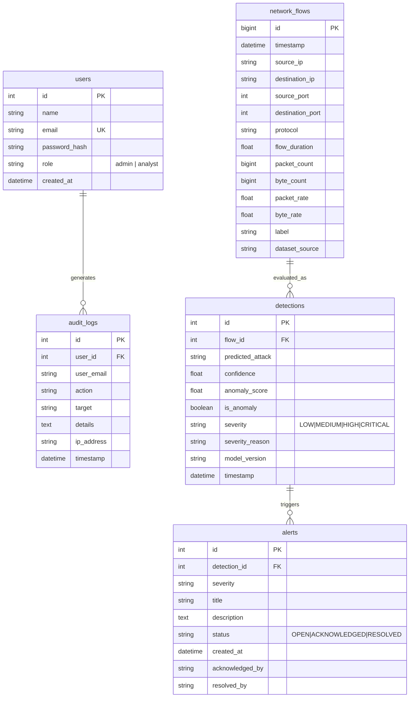

# NetGuard AI — System Architecture Specification

## 1. High-Level Architectural Topology

NetGuard AI is architected as a decoupled, multi-tier cybersecurity intelligence platform uniting high-performance asynchronous telemetry ingestion with multi-stage machine learning inference and real-time WebSocket distribution.

```mermaid
graph TB
    subgraph Client["Presentation Tier (React 18 + Vite)"]
        UI_SOC["SOC Overview Dashboard"]
        UI_Live["Live Telemetry Terminal (WebSocket)"]
        UI_ML["ML Training & Inference Sandbox"]
        UI_Threat["Threat Analytics & Recharts"]
        UI_Alerts["Alert & Incident Lifecycle Management"]
        UI_Admin["Admin & Governance Portal"]
    end

    subgraph Gateway["Application Tier (FastAPI Async)"]
        Router_Auth["Auth & JWT Dependency Engine"]
        Router_Ingest["Telemetry Ingestion & Column Mapper"]
        Router_ML["ML Inference & Training API"]
        Router_Analytics["Threat Analytics Engine"]
        Router_Alerts["Alert Lifecycle Router"]
        Router_Admin["RBAC & Compliance Audit Router"]
        Router_WS["WebSocket Connection Manager"]
    end

    subgraph Engine["Real-Time ML & Simulation Tier"]
        Sim["Synthetic Traffic Simulator (Async Loop)"]
        LivePipeline["Real-Time Live Event Pipeline"]
        Pipeline["Feature Normalization Pipeline"]
        RF["RandomForest Multi-Class Classifier"]
        IF["IsolationForest Anomaly Detector"]
        SeverityRules["Explainable Severity Scoring Matrix"]
    end

    subgraph Data["Persistence Tier (PostgreSQL 16)"]
        DB_Users[("users")]
        DB_Flows[("network_flows")]
        DB_Models[("models (registry)")]
        DB_Detections[("detections")]
        DB_Alerts[("alerts")]
        DB_Audit[("audit_logs")]
    end

    UI_SOC --> Gateway
    UI_Live <-->|WebSocket| Router_WS
    UI_ML --> Router_ML
    UI_Threat --> Router_Analytics
    UI_Alerts --> Router_Alerts
    UI_Admin --> Router_Admin

    Gateway --> Engine
    Sim --> LivePipeline
    LivePipeline --> RF
    LivePipeline --> IF
    LivePipeline --> SeverityRules
    LivePipeline --> Router_WS

    Gateway --> Data
    LivePipeline --> DB_Flows
    LivePipeline --> DB_Detections
    LivePipeline --> DB_Alerts
```



---

## 2. Real-Time Telemetry Processing Pipeline (Phase 7)

```text
Synthetic / Ingested Flow
        │
        ▼
[1. Validation Layer]   ─── Verify IP syntax, port limits (0-65535), duration > 0, packets >= 1
        │
        ▼
[2. Feature Extractor]  ─── Compute packet_rate, byte_rate, protocol encoding
        │
        ▼
[3. Flow Persistence]   ─── Insert record into PostgreSQL 'network_flows'
        │
        ▼
[4. Dual-Stage ML]      ─── Stage A: RandomForest multi-class attack classification
                        ─── Stage B: IsolationForest statistical anomaly score
        │
        ▼
[5. Severity Matrix]    ─── Transparent rule calculation: LOW, MEDIUM, HIGH, CRITICAL
        │
        ▼
[6. Detection Save]     ─── Persist prediction record in 'detections' table
        │
        ▼
[7. Alert Trigger]      ─── If severity in (CRITICAL, HIGH) or anomaly > 0.35, auto-generate 'Alert'
        │
        ▼
[8. Broadcast]          ─── Sub-millisecond JSON event dispatch to all connected WebSockets
```

---

## 3. Database Entity Relationship Diagram (ERD)


